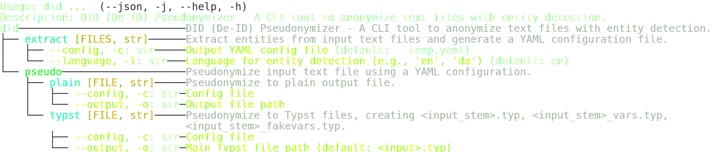

[](https://github.com/evidlabel/did/actions/workflows/pytest.yml)

# DID (De-ID) Pseudonymizer

A CLI tool to anonymize Markdown, plain text, TeX, and BibTeX files with spaCy-based entity detection and automatic YAML configuration.

## Features
- Detects names, emails, addresses, phone numbers, and CPR numbers using Presidio with spaCy
- Groups name and number variants using rapidfuzz
- Extracts entities to generate a YAML config (`did extract`)
- Anonymizes text using YAML config (`did pseudo`), preserving file formats
- Supports English (`en`) and Danish (`da`)

## Installation
```bash
uv pip install https://github.com/evidlabel/did.git
```

## Quick Usage


For details, see the [documentation](docs/index.md).
