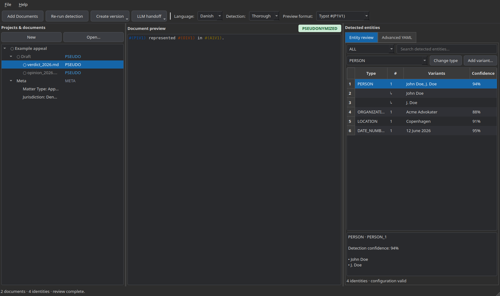

# did

**Aim.** Local-first review and pseudonymization of identity-bearing documents so a human can correct detection, and a remote model never sees the source.

**Use.** Detect entities (Presidio + spaCy, English and Danish). Review in the desktop app. Emit versioned pseudonymized documents, or a token-only Markdown/JSON/ZIP handoff. Placeholders like `#(P1V1)` / `#(P1V2)` are the same person, two written forms.

**Features.**
- CLI + GUI over one on-disk case workdir (mutable draft, checksummed versions)
- Entity review: type correction, aliases, identity merge, persistent exclusions
- Searchable preview, clickable keys, manual labelling
- PDF / DOCX / Markdown / plain-text extraction
- Output verification that re-scans for identifiers that survived replacement
- Faker identities, or irreversible `[REDACTED]`

## GUI



## Install

Python 3.12+, [uv](https://docs.astral.sh/uv/). Language models come from the spaCy releases pinned by this repo:

```bash
uv tool install 'did[models] @ git+https://github.com/evidlabel/did.git'
did --help
did gui
```

## Development

```bash
uv sync --extra models
HEADLESS=1 QT_QPA_PLATFORM=offscreen uv run pytest -v
```

## Disclaimer

Automated detection is not a guarantee of anonymity. Review before sharing.

## License

License: [MIT](LICENSE). CLI: `did -h`. Agents: [`SKILL.md`](SKILL.md).
