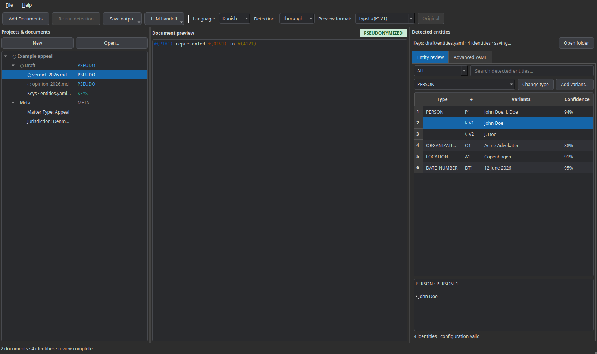

# did

**Aim.** Local-first review and pseudonymization of identity-bearing documents so a human can correct detection, and a remote model never sees the source.

**Use.** Detect entities (Presidio + spaCy, English, Danish, and Swedish). Review in the desktop app. Emit pseudonymized documents into one output folder, or a token-only Markdown/JSON/ZIP handoff. Placeholders like `#(P1V1)` / `#(P1V2)` are the same person, two written forms.

**Features.**
- CLI + GUI over one on-disk case workdir (mutable draft, one rewritten output)
- Entity review: type correction, aliases, identity merge, persistent exclusions
- Searchable preview, clickable keys, manual labelling
- PDF / DOCX / Markdown / plain-text and other text formats extraction
- Output verification that re-scans for identifiers that survived replacement
- Faker identities, or irreversible `[REDACTED]`

## GUI



## Install

Python 3.12+, [uv](https://docs.astral.sh/uv/). Default is CLI only (no Qt). Language models and the GUI are extras:

```bash
uv tool install 'did[models] @ git+https://github.com/evidlabel/did.git'   # CLI + spaCy models
uv tool install 'did[all] @ git+https://github.com/evidlabel/did.git'      # + Qt GUI
did --help
did gui    # needs extra did[gui] (included in did[all])
did models da    # fetch only the models a language needs (here Danish + English)
```

Missing models never block you. The GUI downloads the model for a document's
language the first time you detect in it, and `did models [da en sv]` installs
them ahead of time. Only the missing model wheels are installed; no other
package changes. In a checkout, `make models` does the same.

## Development

```bash
uv sync --all-extras
HEADLESS=1 QT_QPA_PLATFORM=offscreen uv run pytest -v
```

## Disclaimer

Automated detection is not a guarantee of anonymity. Review before sharing.

## License

License: [MIT](LICENSE). CLI: `did -h`. Agents: [`SKILL.md`](SKILL.md).
